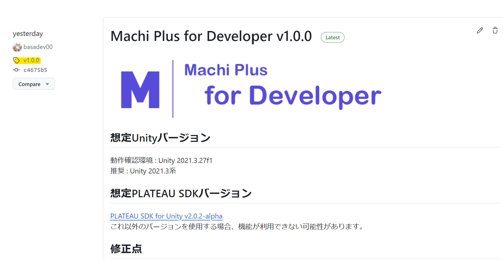

# Machi Plus For Developer
Machi Plus For Developer は、[PLATEAU](https://www.mlit.go.jp/plateau/)のLOD1建物データのテクスチャをMachiPlusプラットフォームから取得する開発者用ツールです。  
Machi Plusプラットフォームに蓄積されているLOD1のテクスチャを取得・適用することができます。  
Machi Plus For Developer を利用することで、PLATEAUのLOD1の建物を実世界に近づけた景観にすることにより、開発するアプリケーションによるユーザーの体験価値を高めることができます。  
**Machi Plus ForDeveloper は [PLATEAU SDK for Unity](https://github.com/Project-PLATEAU/PLATEAU-SDK-for-Unity) を前提とするアドオンです。** 

# MachiPlusで現在対応しているエリア
 [Machi Plus のWebページ](https://orchid966621.studio.site/)をご確認ください。

# サンプルシーン
PackageManagerからダウンロードできるサンプルシーンを使ってツールの動作を確認が可能です。
https://github.com/basadev00/Machi-Plus-for-Developer/assets/69620523/34890d6d-6537-4107-9356-8f7231c7b439

# セットアップ環境

## 検証済環境
### 推奨OS環境
- Windows 11

### Unity バージョン
- Unity 2021.3.27f1
    - Unity 2021.3系であれば問題なく動作する見込みです。

### レンダリングパイプライン
- Built-in Rendering Pipeline

## PLATEAU SDKバージョン
- [PLATEAU SDK for Unity v2.0.2-alpha](https://github.com/Project-PLATEAU/PLATEAU-SDK-for-Unity/releases/tag/v2.0.2-alpha)
- [PLATEAU SDK for Unity v2.3.2](https://github.com/Project-PLATEAU/PLATEAU-SDK-for-Unity/releases/tag/v2.3.2)
    - これ以外のバージョンを使用する場合、機能が利用できない可能性があります。
    - 
## 導入手順

### 1. Unityでのプロジェクト作成
Unity バージョン 2021.3.27f1で「3D」のテンプレートから Unity プロジェクトを作成してください。  
Unityのメニューバーから File → Build Setting → Player Setteing → PlayerのOtherSettingのRendering Color Spaceを「Linear」 を選択し、BuildingSettingのWindowを閉じてください。

### 2. PLATEAU SDK for Unityのインストール　※必ず3より先に実施ください。
PLATEAU SDK-Toolkits for Unityを利用するにあたり、事前にPLATEAU SDKのインストールが必要となります。  
TarballかGitHub URLからインストールをする必要があります。詳細はPLATEAU SDKのドキュメンテーションをご参照ください。  
[PLATEAU SDK for Unity利用マニュアル](https://project-plateau.github.io/PLATEAU-SDK-for-Unity/)

PLATEAU SDKを利用し、対応エリアの3D都市モデルをシーン上へ配置してください。  （ダウンロードの際に属性情報を含めるようにしてください）

### 3. Machi Plus For Developer のインストール
1. 導入したいバージョンを確認するため、 [Machi Plus for Developer のリリースページ](https://github.com/basadev00/Machi-Plus-for-Developer/releases) にアクセスします。
2. リリースのリンクをクリックし、導入したいバージョンのタグ（画像の箇所）をメモします。

3. Unityのメニューバーから Window → Package Manager を選択します。
4. Package Manager ウィンドウの左上の＋ボタンから Add pacakge from git URL... を選択します。
5. 入力欄に次を入力します。 
G. GithubリポジトリのURLに、#(先ほどメモしたタグ名) を付けたものを入力してください。  例えば次のとおりです：
https://github.com/basadev00/Machi-Plus-for-Developer.git#v1.0.0
7. Add ボタンを押します。

  
9. ウィンドウのパッケージ一覧に Machi Plus for Developer が表示されたら完了です。
10. サンプルシーンはSamplesタブからダウンロードが可能です。

## Machi Plus For Developer の使い方

1. テクスチャを反映させたい3D都市モデルのLOD1の建物を選択します。（複数選択可）
2. Unityのメニューバーから PLATEAU → ExecuteUserGeneratedTextureLoader を選択します。
3. コンソールウィンドウに「実行が終了しました。」と表示されるまで待ちます。（選択した建物のうち、適用できる建物のみにテクスチャが反映されます）

## Machi Plus For Developer 利用の注意事項
- PlayerのOtherSettingのRendering Color Spaceを「Linear」になっていないとビルドでエラーが発生します。

## ライセンス
- 本リポジトリはMITライセンスで提供されています。

## 注意事項/利用規約
- 本リポジトリの利用により生じた損失及び損害等について、提供者はいかなる責任も負わないものとします。
